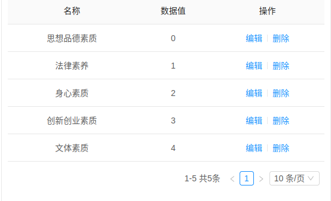
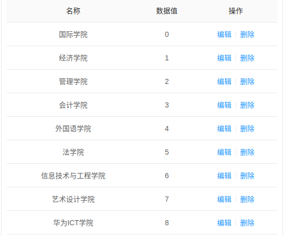

# 表导入改动说明

## 1.学时记录表导入说明

student_credit_verify

进入数据库里把数据库设置的外键删除

复制旧表的数据表结构到student_activity_record进行以下的修改操作

| 字段         | 操作             | 字段长度         | 字段类型         |
| ------------ | ---------------- | ---------------- | ---------------- |
| activity_name | 活动名称          | 255       | String   |
| sponsor      | 主办方学院      | 255   | String |
| uid          | 学号             | 20           | String       |
| name         | 姓名             | 20           | String       |
| academy      | 学院             | 20           | String       |
| clazz        | 班级             | 20          | String       |
| join_type     | 参加类型         | 20       | String   |
| award        | 获奖情况         | 20       | String   |
| credit_type   | 学时类型         | 20       | String   |
| credit       | 学时数量         | 22       | Double   |
| contact      | 填报人及联系方式 | 255 | String |
| to_name | 审核人           | 20         | String     |
| remark       | 删除             |             |          |
| verify       | 删除             |              |              |
| createdAt    | 修改字段名create_time | 0 | Date |
| toId         | 删除             |              |              |
| userId       | 删除             |              |              |
| year         | 学年             | 50           | String       |
| failReason   | 删除             |              |              |
| isFail       | 删除             |              |              |
| update_time | 更新时间     | 0    | Date |
| create_by | 创建人      | 50    | String |
| update_by | 更新人        | 50      | String  |
| sys_org_code | 所属部门       | 64     | String |
|  |          |          |          |

```
INSERT INTO student_activity_record ( id,activity_name, sponsor, uid, `name`, academy, clazz, join_type, award, credit_type, credit, contact, to_name, create_time ) SELECT
B.id,B.activity_name,B.sponsor,B.uid,B.`name`,B.academy,B.clazz,B.join_type,B.award,credit_type,B.credit,B.contact,B.to_name,B.created_at
FROM
	student_credit_verify AS B
使用sql语句把旧表数据插入到新表中
进入jeecg系统在线开发中导入student_activity_record数据表
```



学时类型数据字典



学院数据字典
